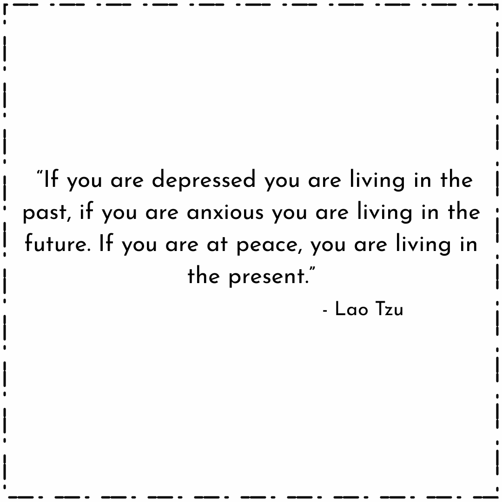
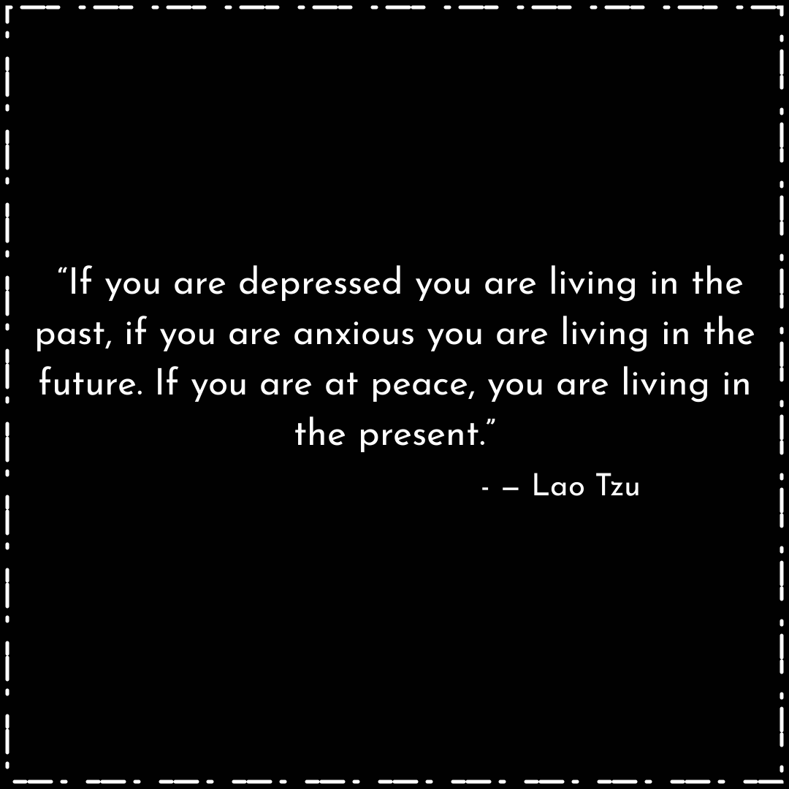

# quote2img

Open REST API to generate images of quotes

## Using the API
To generate an image using the API, 
Make a HTTP POST request to https://quote2img.vercel.app/api/imagequote with the follwing JSON in the request body.
The `styleName` property can either be set to `light` or `dark`. 

The generated images will be 1080x1080

```json
{
    "quoteText": "If you are depressed you are living in the past, if you are anxious you are living in the future. If you are at peace, you are living in the present.",
    "authorName": "Lao Tzu",
    "styleName": "light"
}
```

## Sample API request using cURL
**Note**: The generated image will be saved to the file image.png in your current working directory.
```sh
curl --location --request POST 'quote2img.vercel.app/api/imagequote' \
--header 'Content-Type: application/json' \
--data-raw '{
    "quoteText": "If you are depressed you are living in the past, if you are anxious you are living in the future. If you are at peace, you are living in the present.",
    "authorName": "Lao Tzu",
    "styleName": "light"
}' \
-o image.png
```

## Sample Images generated using quote2img API

### Light style


### Dark style


## Running the API locally

1. Since this project uses Vercel Serverless functions, `vercel` has to be installed. `npm i -g vercel`
2. Navigate to the project root folder and run `vercel dev` to start the local development server on localhost port 3000.
